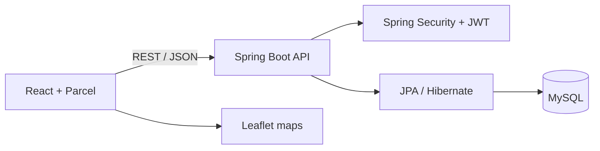

# USC Study Spot Finder

[](https://github.com/Jaime888888/usc-study-spot-finder/actions/workflows/ci.yml)

A full-stack platform for discovering, saving, rating, and reviewing study spaces near the University of Southern California. Unlike a general map product, Study Spot Finder focuses on the details students care about—including specific rooms, study environment, hours, notes, and community feedback.

## Features

- Browse study locations on an interactive map
- View detailed information, hours, notes, photos, and average ratings
- Register and sign in with JWT-based authentication
- Add new study spots with location and schedule information
- Write reviews and rate existing locations
- Save and manage favorite study spots
- Protect authenticated API routes with JWT-based security
- Persist users, locations, hours, reviews, and favorites in MySQL

## Architecture



## Technology

| Layer | Technology |
| --- | --- |
| Frontend | React 18, React Router, React Leaflet, Parcel |
| Backend | Java 17, Spring Boot, Spring Web, Spring Security |
| Data | MySQL, Spring Data JPA, Hibernate |
| Authentication | JSON Web Tokens (JJWT) |
| Development | Maven Wrapper, Docker Compose, Adminer |

## Repository layout

```text
.
├── frontend/
│   ├── public/                 # HTML shell and static assets
│   └── src/
│       ├── api/                # Auth, spot, review, and favorite clients
│       ├── components/         # Navigation, cards, and ratings
│       ├── context/            # Authentication state
│       ├── pages/              # Map, details, favorites, login, and add-spot views
│       └── routes/             # Application routing
└── backend/
    ├── api.md                  # Detailed API guide
    └── demo/
        ├── docker-compose.yml  # Local MySQL and Adminer
        ├── pom.xml             # Maven dependencies
        └── src/                # Controllers, services, security, models, repositories
```

## Local development

### Prerequisites

- Node.js 22 LTS
- Java 17
- Docker Desktop

### 1. Start the database

```bash
cd backend/demo
cp .env.example .env
# Replace the password and JWT placeholders in .env.
docker compose up -d
```

This starts MySQL on port `33061` and Adminer at `http://localhost:8081`. Docker Compose and Spring Boot both read the same `.env` values, so the database name and credentials stay aligned.

### 2. Run the backend

From `backend/demo`:

```bash
./mvnw spring-boot:run
```

On Windows:

```powershell
.\mvnw.cmd spring-boot:run
```

The API runs at `http://localhost:8080` by default.

### 3. Run the frontend

In a separate terminal:

```bash
cd frontend
cp .env.example .env
npm ci
npm start
```

The Parcel development server runs at `http://localhost:3000`. Its example environment points API requests to the local backend; deployed builds default to same-origin `/api` unless `STUDYSPOT_API_BASE_URL` is set.

## API overview

| Area | Representative endpoints |
| --- | --- |
| Authentication | `POST /auth/register`, `POST /auth/login` |
| Study spots | `GET /spots`, `GET /spots/{id}`, `POST /spots` |
| Reviews | Review creation and retrieval through the review controller |
| Favorites | Per-user favorite creation, listing, and removal |

Except for `/auth/*`, secured routes expect:

```http
Authorization: Bearer <token>
```

See [`backend/api.md`](./backend/api.md) for request examples, response shapes, and implementation references.

## Security notes

- Local configuration templates contain placeholders only and committed application properties contain no credentials.
- Generate unique database and JWT secrets before shared use or deployment.
- Set `CORS_ALLOWED_ORIGINS` to the exact deployed frontend origins.
- Do not expose development database or Adminer ports publicly.

